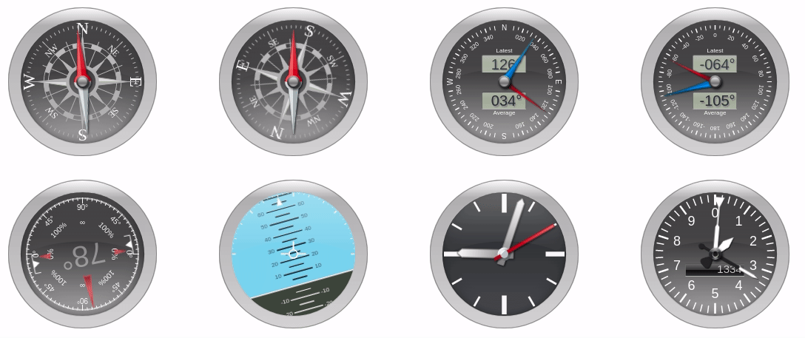

# Steelseries Gauges

[](https://github.com/nicolas-van/steelseries/actions)
[](https://www.npmjs.com/package/steelseries)
[](https://www.webcomponents.org/element/steelseries)
[](https://www.jsdelivr.com/package/npm/steelseries)



      
The steelseries library is a collection of animated gauges components related to navigation.

These components are packed as web components, which means they do not necessitate knowledge in Javascript
in order to be used on web pages. Just include the following snippet in your HTML file:

```
  <script type="module" src="https://cdn.jsdelivr.net/npm/steelseries@2.0.6/dist/steelseries.bundled.min.js"></script>
```

Then select one of the compoments displayed [in the documentation](https://nicolas-van.github.io/steelseries/), adjust the parameters as you see fit and copy paste the resulting
code in your HTML. That's it, the component should now display correctly on your web page.

[See the documentation here](https://nicolas-van.github.io/steelseries/).

This project was forked from [HanSolo's SteelSeries-Canvas](https://github.com/HanSolo/SteelSeries-Canvas).

## Development

### Installation

#### Using jsdelivr

https://www.jsdelivr.com/package/npm/steelseries

#### Using npm

```bash
npm install steelseries
```

```javascript
import "steelseries"
```

### Example code

```html
<steelseries-compass value="75"></steelseries-compass>
```

### Using a web framework (React, Angular, Vue,...)

Same as in the example code.

Web components integrate naturally with any web framework. You just have to import the project correctly and
use the component as if it was normal HTML. No wrapper is needed.

Some web frameworks do perform so kind of validation by default to ensure all elements are know elements. That feature is not compatible with web components and must be deactivated to use web components at all. Hopefully that feature will be deactivated in all web frameworks one day but in the mean time you just have to refer to your framework's documentation or make a Google search with "how to use web components with X" and you should find the solution without problem.

### Migration from 1.0

In version 2.0 all the API has been rewritten to [web components](https://developer.mozilla.org/fr/docs/Web/Web_Components), which makes it a major change breaking all the API. During that process multiple features were
removed because they were more complicated to implement in the context of web components.

This change was made in order to make the library more accessible to non-programmer users, most notably web site authors that may not have advanced JavaScript knowledge. That rewrite also allowed to make an interactive documentation which also makes this library way easier to use.

If you already integrated steelseries in one of you project I would recommend to stick with version 1.0 until you can rewrite all the code to use the new web components API. If you miss one the previous features you can still re-implement them and make a pull request in this repository.
