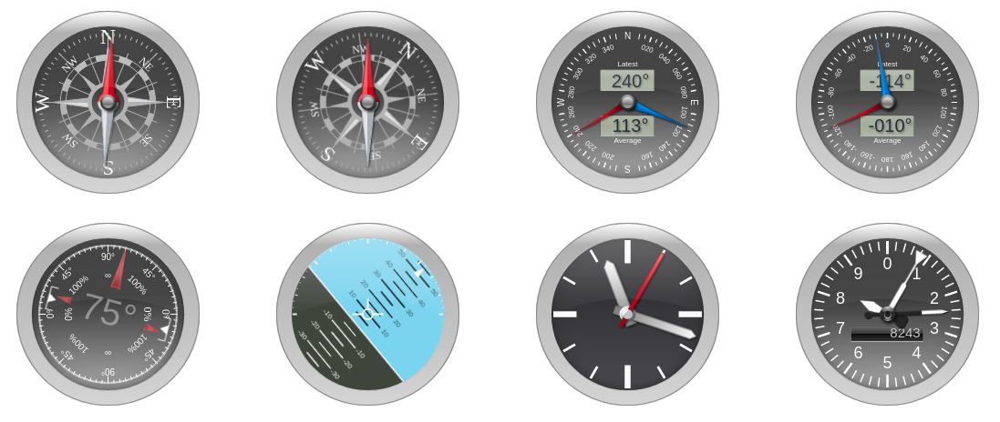

# Steelseries Gauges

[](https://travis-ci.org/nicolas-van/steelseries) [](https://www.npmjs.com/package/steelseries)

A collection of gauge components for JavaScript.

[See the demo here](https://nicolas-van.github.io/steelseries/).



This project is a re-packaging of [HanSolo's SteelSeries-Canvas](https://github.com/HanSolo/SteelSeries-Canvas).

## Usage

### The modern way

```bash
npm install steelseries
```

```javascript
import * as steelseries from "steelseries";
```

### The old school way

Download this code at https://unpkg.com/steelseries .

## Documentation

Unfortunately there is no formal documentation :) . But you can take a look at the [Demo Website](https://nicolas-van.github.io/steelseries/) and [it's source code](https://github.com/nicolas-van/steelseries/tree/develop/srcdocs).
